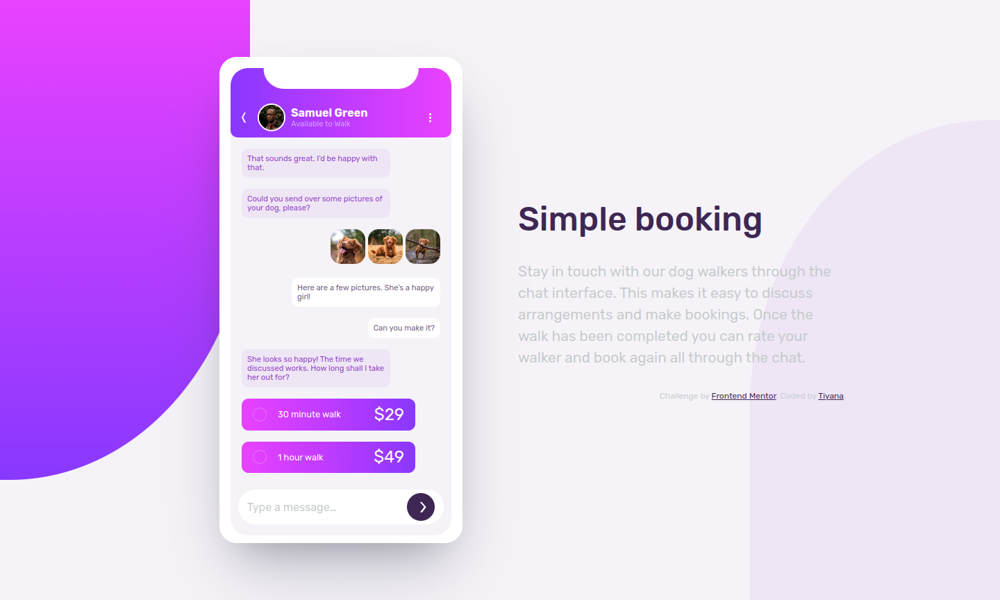
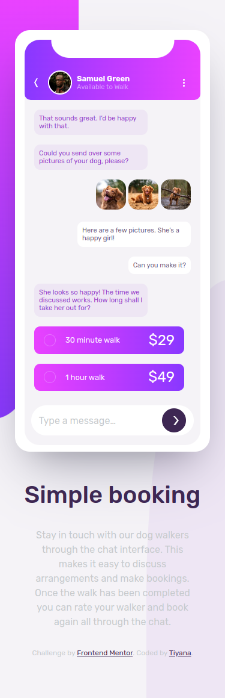

# Frontend Mentor - Chat app CSS illustration solution

This is a solution to the [Chat app CSS illustration challenge on Frontend Mentor](https://www.frontendmentor.io/challenges/chat-app-css-illustration-O5auMkFqY). Frontend Mentor challenges help you improve your coding skills by building realistic projects.

## Table of contents

- [Overview](#overview)
  - [The challenge](#the-challenge)
  - [Screenshot](#screenshot)
  - [Links](#links)
- [My process](#my-process)
  - [Built with](#built-with)
  - [What I learned](#what-i-learned)
  - [Continued development](#continued-development)
- [Author](#author)

## Overview

### The challenge

Users should be able to:

- View the optimal layout for the component depending on their device's screen size
- **Bonus**: See the chat interface animate on the initial load

### Screenshot





### Links

- Solution URL: [Solution URL here](https://github.com/Tiyana19/chat-app-css-illustration)
- Live Site URL: [Live site URL here](https://tiyana19.github.io/chat-app-css-illustration/)

## My process

### Built with

- Semantic HTML5 markup
- CSS custom properties
- CSS Grid
- Position property

### What I learned

I have Learend about putting colors in root and using them by its variable name.

```css
:root {
  --Pale-Violet: hsl(276, 100%, 81%);
  --Moderate-Violet: hsl(276, 55%, 52%);
  --Desaturated-Dark-Violet: hsl(271, 15%, 43%);
  --Grayish-Blue: hsl(206, 6%, 79%);
  --Very-Dark-Desaturated-Violet: hsl(271, 36%, 24%);
  --Dark-Grayish-Violet: hsl(270, 7%, 64%);
  --White: hsl(0, 0%, 100%);
  --Light-Grayish-Violet: hsl(270, 20%, 96%);
  --Very-Light-Magenta: hsl(289, 100%, 72%);
  --light-gray: hsl(272, 41%, 93%);
}
```

Here I have used clip-path properties to make arrows;

```css
.back-arrow {
  display: inline-block;
  width: 15px;
  height: 15px;
  background-color: var(--White);
  clip-path: polygon(41% 0, 14% 50%, 42% 100%, 25% 100%, 0% 50%, 28% 0);
  cursor: pointer;
}

.chat-page .type-box .send-arrow {
  display: inline-block;
  width: 15px;
  height: 15px;
  background-color: var(--White);
  clip-path: polygon(57% 0, 100% 50%, 62% 100%, 41% 100%, 81% 49%, 38% 0);
  cursor: pointer;
}
```

### Continued development

I will continue to explore these properties

- Position
- Width
- height

## Author

- Frontend Mentor - [@tiyana19](https://www.frontendmentor.io/profile/Tiyana19)
